.. include:: global.rst

.. _armado:

Montaje del sistema
***********************
En esta seccion se detallan las instrucciones de armado del sistema.

**IMPORTANTE** 
Si bien los sensores estan disenados para operar sumergidos en agua o en suelo humedo, la parte del sistema mostrado en la :ref:numref:`montaje_final` **NO** es resistente al agua por lo que una vez montado se debe cubrir, por ejemplo, con una cubierta plastica o ubicar en un lugar donde no le llegue agua.

.. _montaje_final:
.. figure:: _imgs/IMG_5901.jpg
   :align: center

   Montaje completo.

Lista de Materiales
===================

.. _Materiales:
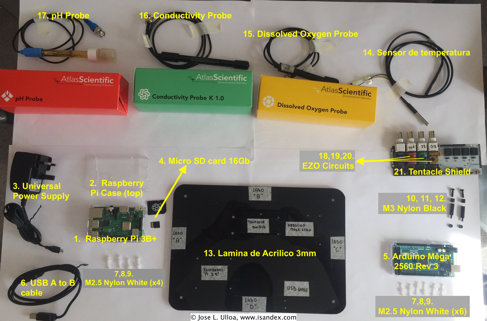
   
   Materiales

.. _LdeMateriales:
.. csv-table:: "Lista de Materiales"
   :file: _misc/table_01.csv
   :widths: 5 90 5
   :header-rows: 1

Esta guia de instalacion asume que la placa de acrilico se orienta como se muestra en la :ref:numref:`placa`

.. _placa:
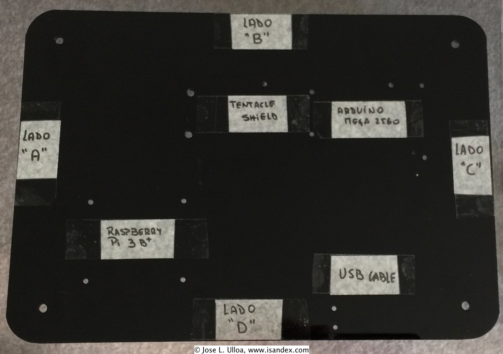

   Orientacion de la placa para comenzar montaje.

Montaje de la |rpi|_
=====================
1. La |rpi|_ se fijara en los agujeros indicados por el circulo amarillo en la :ref:numref:`plate_rpi`.

.. _plate_rpi:
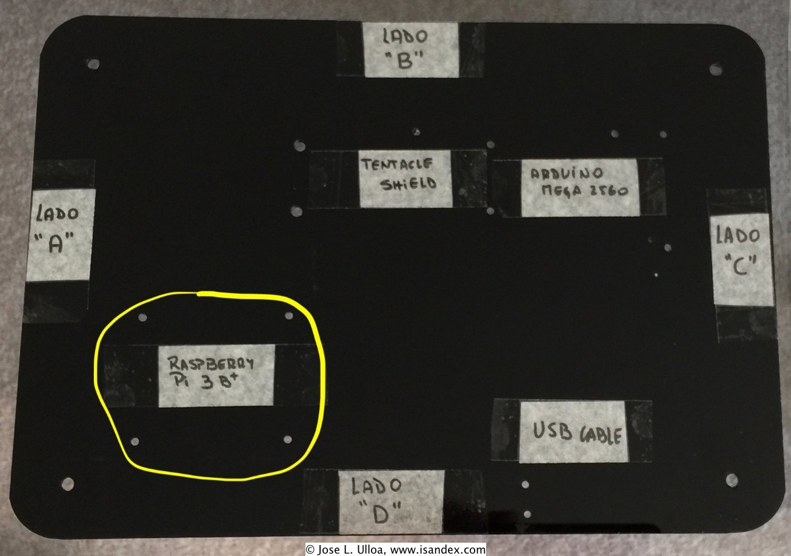

   Localizacion de la |rpi|_ en la placa de soporte.

2. Para fijar la |rpi|_ se debe retirar la cubierta superior de la caja protectora. No forzar la cubierta para sacarla, solo hacer un poco de presion hacia un lado y levantar.

.. _rpi3b:
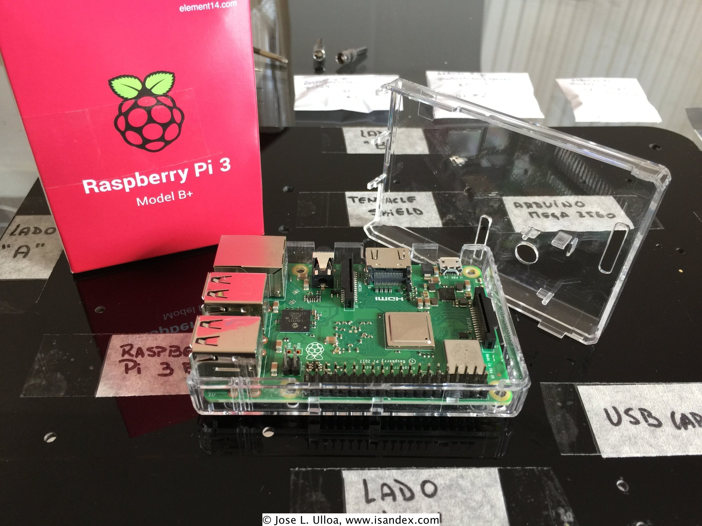

   Para fijar la |rpi|_ solo se necesita retirar la tapa de la caja protectora. La base y la |rpi|_ se fijan juntas a la placa.

3. Para fijar la |rpi|_ a la placa, se requieren 4 set de tornillo, tuerca y espaciadores M2.5 (Items #7,8 & 9 en :ref:numref:`LdeMateriales`)

.. _fix_rpi:
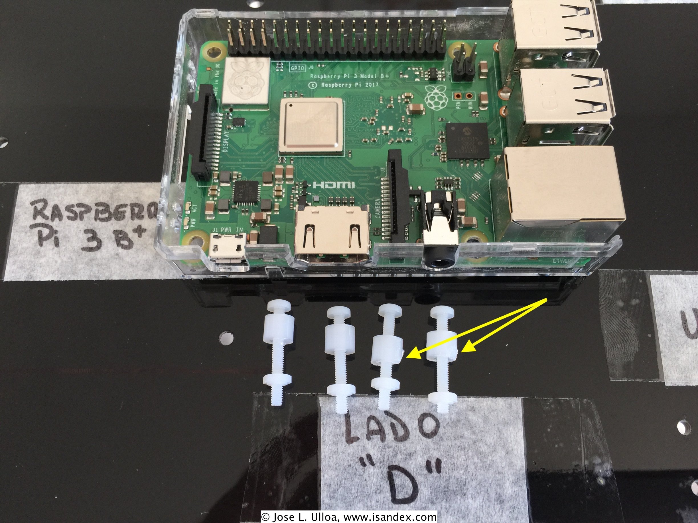

   Ubicacion del computador de control en la placa y elementos de fijacion.

Notese los dos espaciadores de la derecha (flecha amarilla en :ref:numref:`fix_rpi`) tienen una "muesca" para acomodar el relieve de la caja de la |rpi|_

.. _muesca:
.. figure:: _imgs/IMG_5842.jpg
   :align: center

   Relieve en la caja de la |rpi|_

4. La cabeza de los tornillos queda por la parte trasera de la placa de acrilico.

.. _screw:
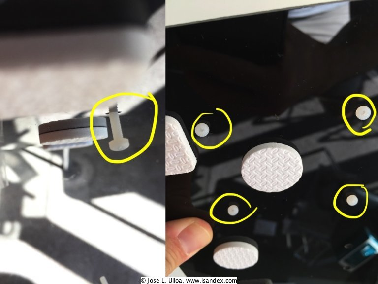

   Tornillos de fijacion |rpi|_

5. Ubicar los 4 espaciadores sobre la placa de acrilico.

.. _spacer_pos:
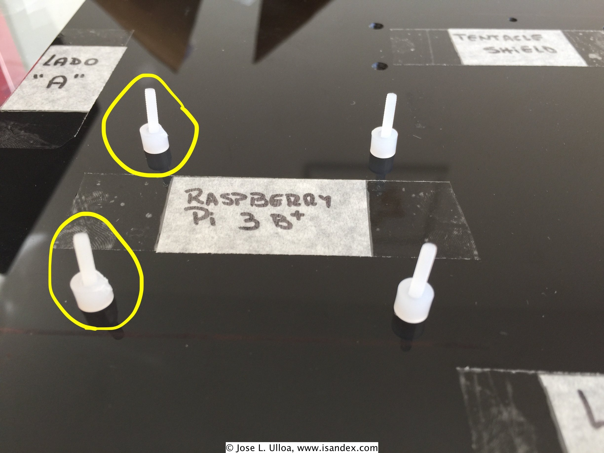

   Posicion de espaciadores y tornillos. Los espaciadores con la "muesca" van al lado derecho (circulos amarillos)

6. Encajar la |rpi|_ en los 4 tornillos sobre los espaciadores. Asegurarse que la orientacion es igual a como se muestra en la figura.

.. _rpi3_pos:
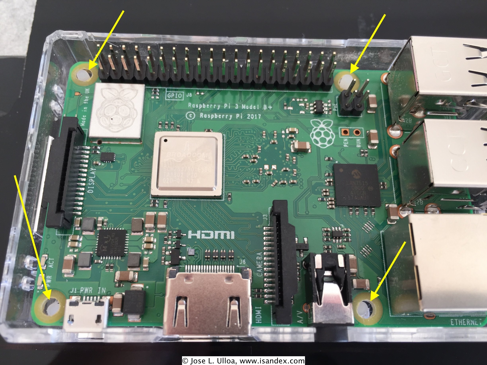

   Alinear los tornillos con los agujeros de la |rpi|_.

7. Fijar los tornillos con las tuercas M2.5. Utilizar una pinza o similar, para sostener la tuerca mientras se fija el tornillo.

.. _rpi3_screwed:
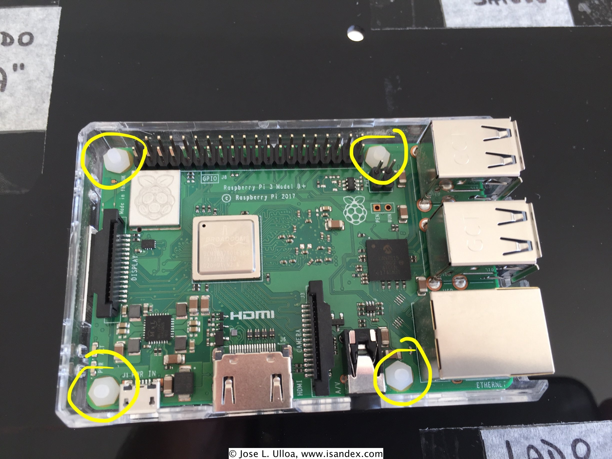

   Se recomienda utilizar una pinza para sostener las tuercas mientras se fijan los tornillos por la parte inferior.

8. La |rpi|_ deberia quedar firmemente sostenida a la placa. La cubierta se debe poder poner sin necesidad de aplicar fuerza, solo un poco de presion, comenzando por un lado.

.. _rpi3_fixed:
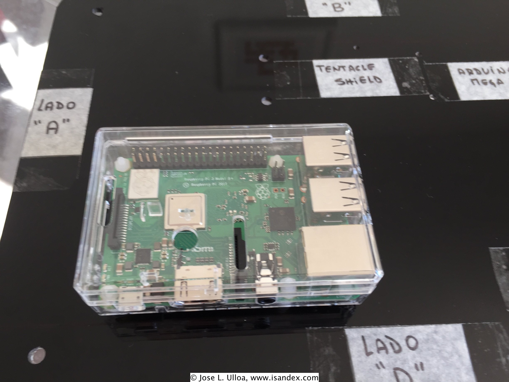

   Posicion definitiva de la |rpi|_ en la placa de acrilico.

Montaje del |arduino|_
======================
1. El microcontrolador |arduino|_ se fijara en los agujeros indicados por el circulo amarillo en la :ref:numref:`ardv_loc`.

.. _ardv_loc:
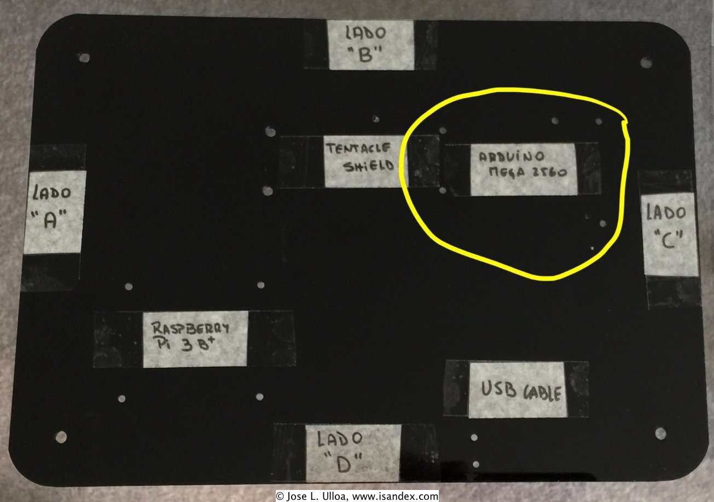

   Localizacion del |arduino|_ en la placa de soporte.x

2. |arduino|_ se fija con 6 sets de tornillo, tuerca y espaciadores M2.5 (Items #7,8 & 9 en Tabla :ref:numref:`LdeMateriales`)

.. _ardv_fix:
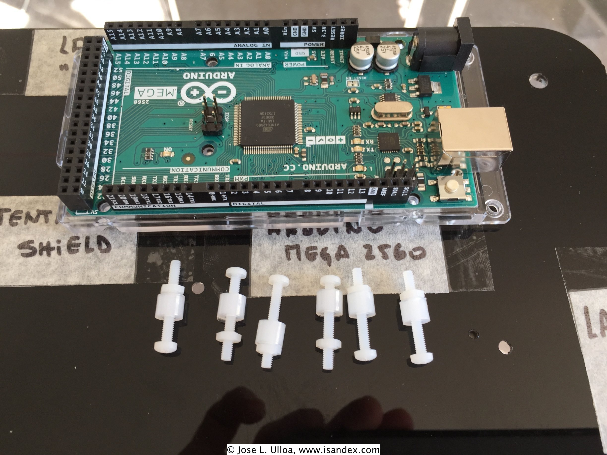

   Ubicacion en la placa del microcontrolador y elementos de fijacion.

3. La cabeza de los tornillos queda por la parte trasera de la placa de acrilico. Sobre la placa se ubican los 6 espaciadores correspondientes.

.. _ardv_spacers:
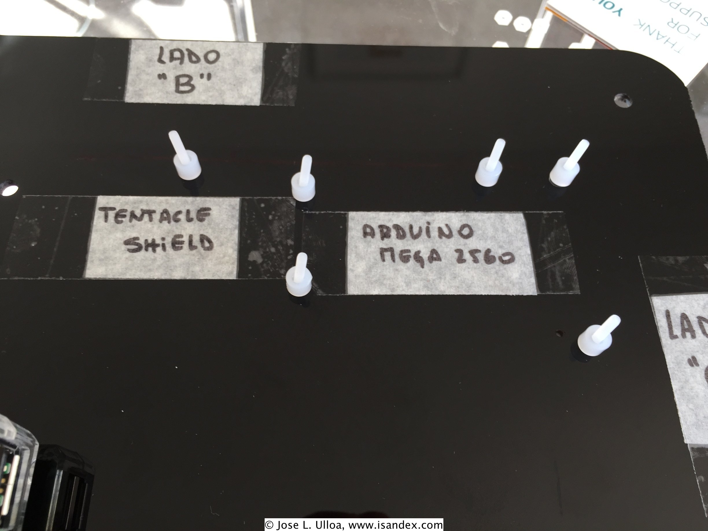

   Tornillos de fijacion |arduino|_ y espaciadores

4. Encajar el |arduino|_ en los tornillos. Notese que no todos los agujeros del |arduino|_ son utilizados.

.. _ardv_screw:
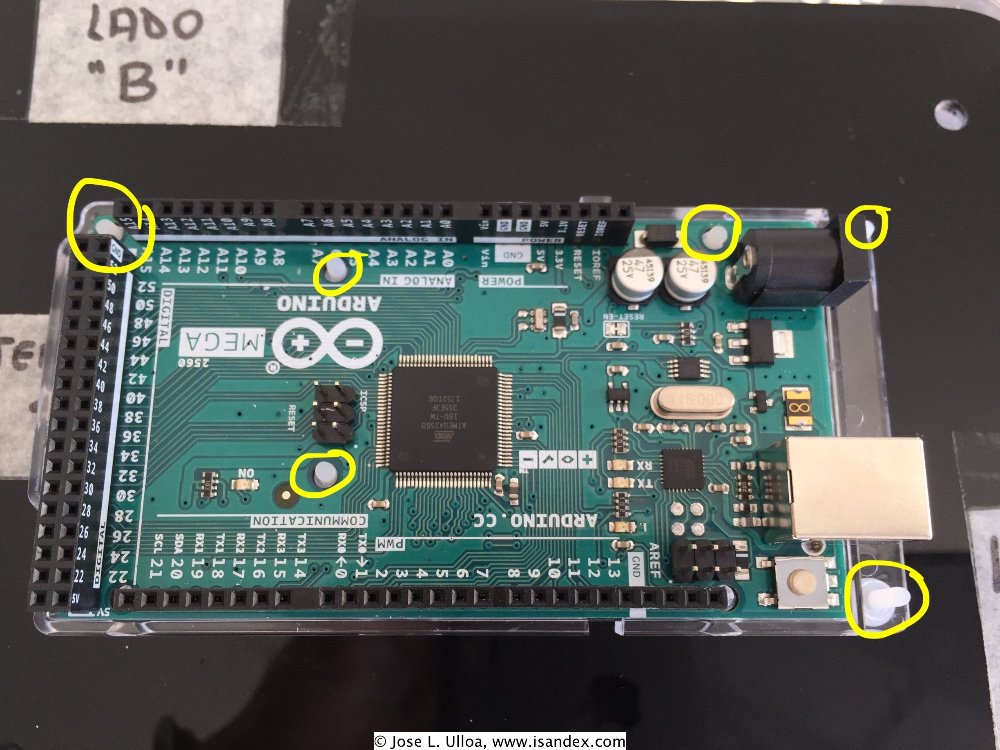

   Solo 6 agujeros del |arduino|_ son utilizados para fijarse a la placa de acrilico

5. Luego de apretar las tuercas, el |arduino|_ deberia quedar firmemente fijado a la placa.

.. _ardv_fixed:
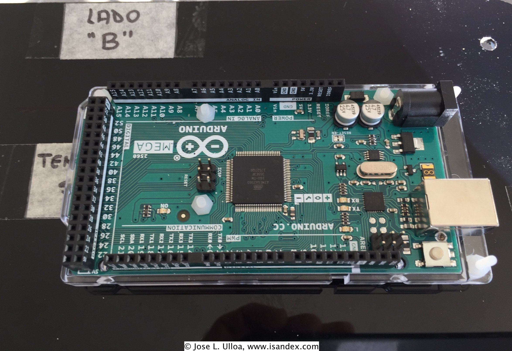

   Posicion definitiva del |arduino|_ en la placa de acrilico.

Montaje del |tentacle|_
=======================
1. El |tentacle|_ (Item #21 en :ref:numref:`LdeMateriales`) se monta sobre el |arduino|_ y se fija a la placa de acrilico en los agujeros indicados por el circulo amarillo en :ref:numref:`tent_loc`. Para fijacion se utilizara los espaciadores y tornillos mostrados en el rectangulo amarillo en la :ref:numref:`tent_loc`

.. _tent_loc:
.. figure:: _imgs/IMG_5827_tentacle.jpg
   :align: center

   |tentacle|_ se fija sobre el |arduino|_ y se apoya en la placa de acrilico con dos set de tornillos y espaciadores

2. Se recomienda fijar los espaciadores M3 (Items #10, 11 y 12 en :ref:numref:`LdeMateriales`) en el |tentacle|_ antes de montarlo en el |arduino|_

.. _tent_fixers:
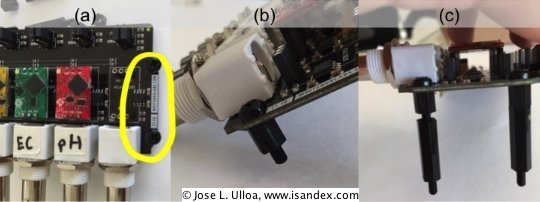

   Elementos para fijar el |tentacle|_ a la placa de acrilico. (a) Tornillos M3 por sobre el |tentacle|_. (b) y (c) Espaciador y "stand-off" fijados a los tornillos.

3. Montar |tentacle|_ al |arduino|_ mediante los pins de conexion. **IMPORTANTE: la correspondencia de pins entre ambos es *critica* para el funcionamiento del sistema!**.

.. _pins_diagr:
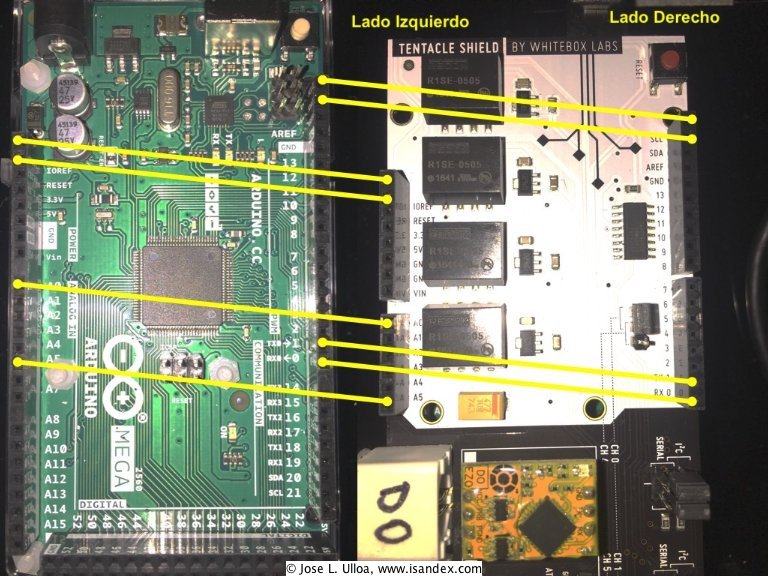

   Correspondencia entre pins del |arduino|_ y |tentacle|_

.. _pins_left:
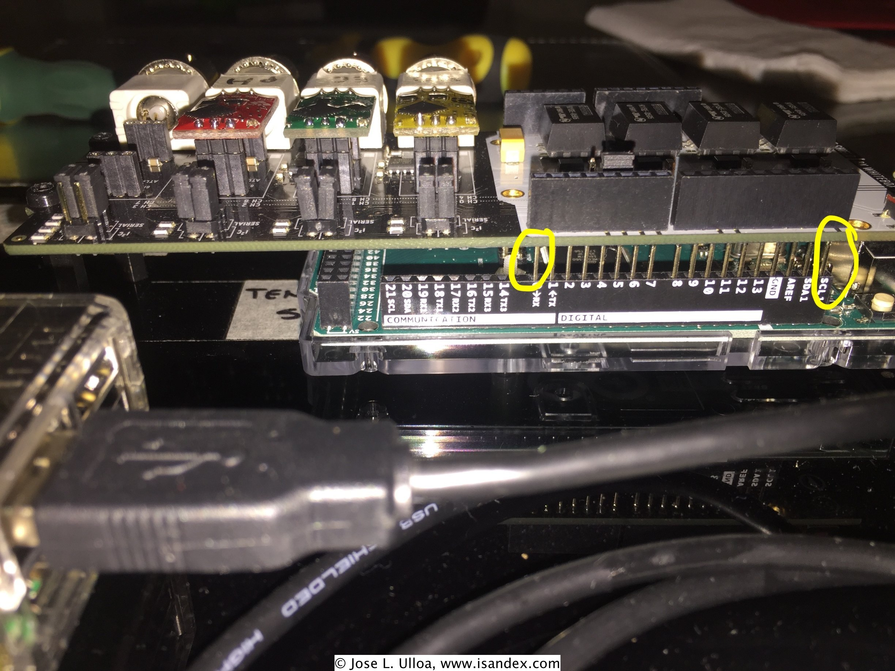

   Vista lateral derecha (ver :ref:numref:`pins_diagr`) de la conexion entre |tentacle|_ y |arduino|_. Pins de referencia para la conexion son el primero (SCL1) y ultimo (Rx)

.. _pins_right:
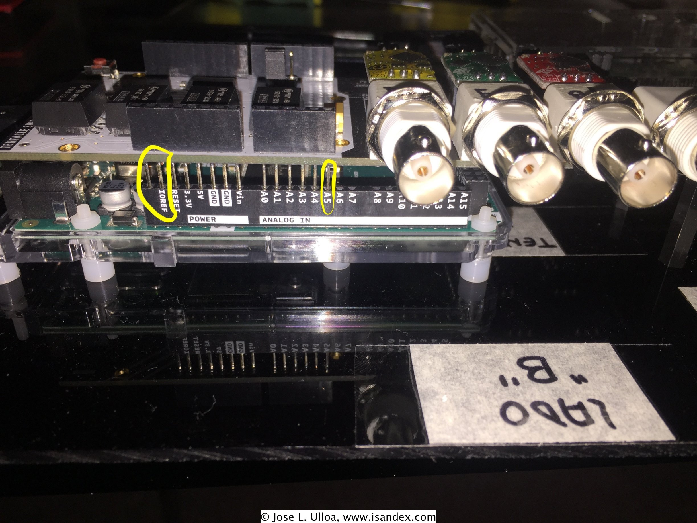

   Vista lateral izquierda (ver :ref:numref:`pins_diagr`) de la conexion entre |tentacle|_ y |arduino|_. Pins de referencia para la conexion son el primero (A5) y los dos ultimos (IOREF y sin nombre)

4. AL mismo tiempo que se conectan los pins, se fija a la placa de acrilico, haciendo coincidir los agujeros.

.. _tentacle_fix:
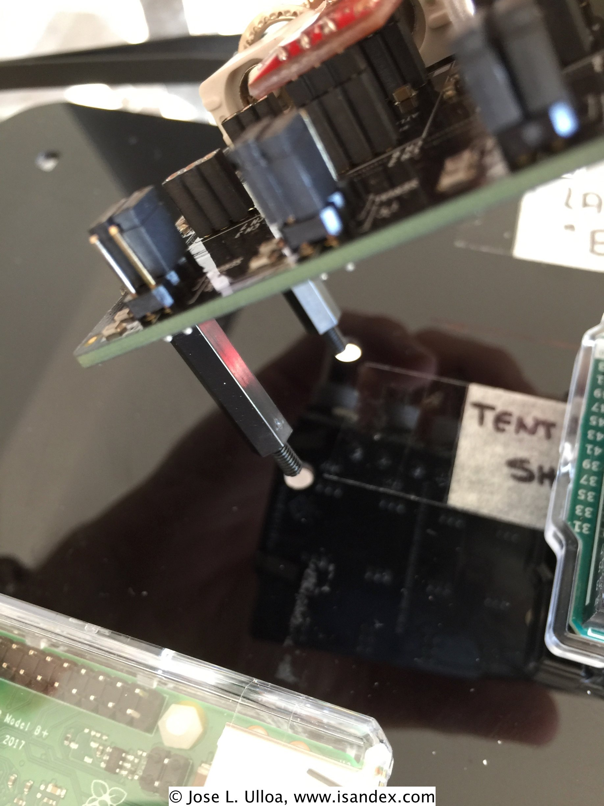

   Fijacion del |tentacle|_ con la placa de acrilico se realiza durante la conexion con el |arduino|_

5. Los soportes se aseguran con las tuercas en la parte inferior de la placa de acrilico.

.. _tentacle_screwed:
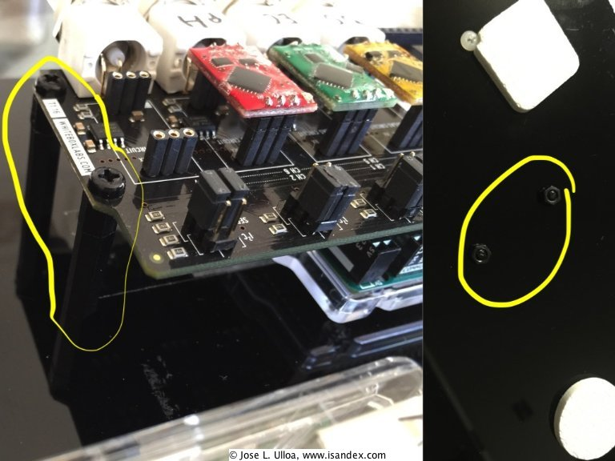

   Vista superior e inferior del |tentacle|_ fijado a la placa de acrilico

.. _tentacle_final:
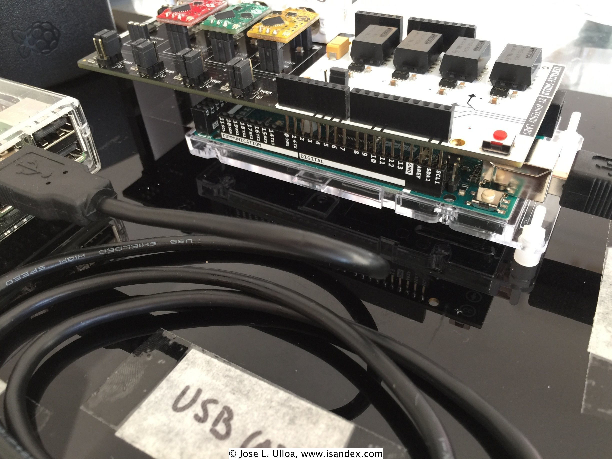

   Posicion definitiva del |tentacle|_ sobre |arduino|_ y fijado a la placa

Conexion entre |rpi|_ y |arduino|_
===================================

La |rpi|_ se comunica serialmente con el |arduino|_ mediante conexion USB (Item #6 en :ref:numref:`LdeMateriales`). Por esa misma conexion, la |rpi|_ energiza el |arduino|_.

.. _serial_conn:
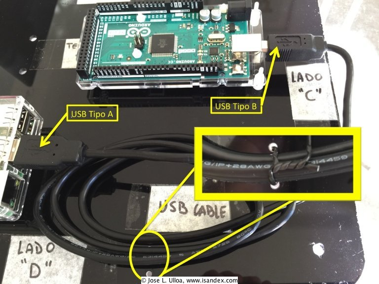

   Conexion USB entre |rpi|_ y |arduino|_

Conexion de sensores al microcontrolador |arduino|_
====================================================

1. Sensor de temperatura DS18B20 (Item #14 en :ref:numref:`LdeMateriales`). Este es el unico sensor del sistema que se conecta directamente a la entrada digital del microcontrolador. Posee 3 terminales: tierra (cable negro), 5Vdc (cable rojo) y datos (cable amarillo).

.. _ds18b20_grnd:
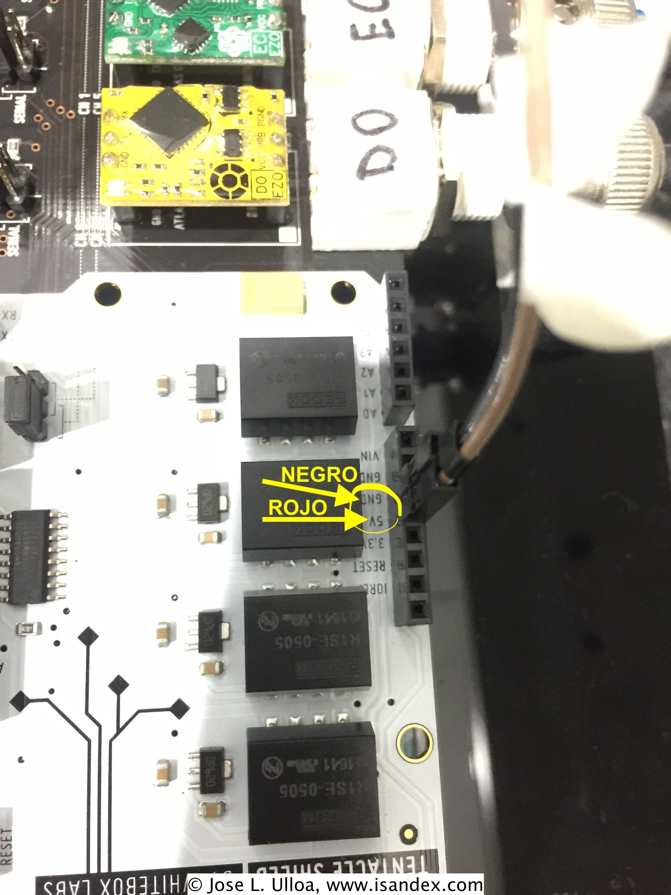

   Conexiones Vin (5V) y tierra (GND) del sensor de temperatura (Item #14 en :ref:numref:`LdeMateriales`)

.. _ds18b20_data:
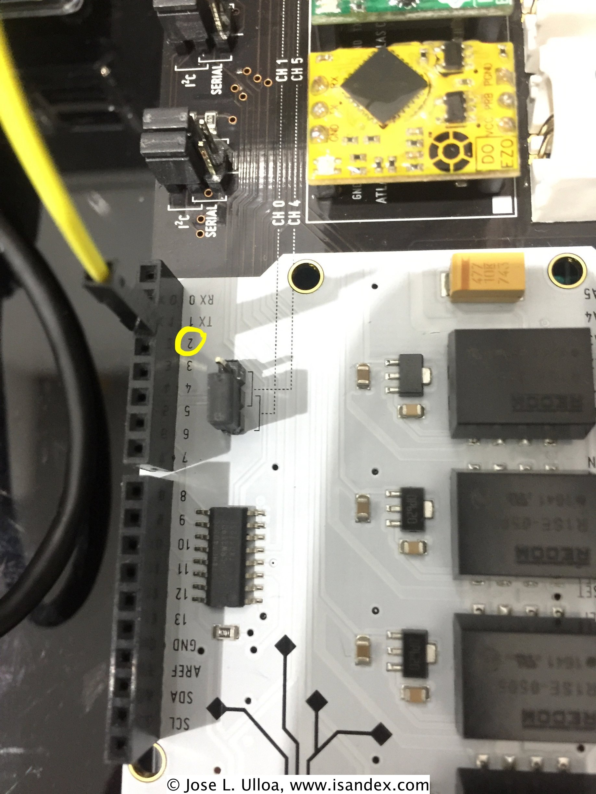

   Conexion del pin de data del sensor de temperatura a la entrada #2 del |arduino|_ (via |tentacle|_)

2. Sensores AtlasScientific (Items #15, 16 y 17 en :ref:numref:`LdeMateriales`). Estos sensores se comunican mediante los conectores BNC del |tentacle|_. Estan indicados claramente la correspondencia entre los cables y conectores. **Es importante mantener esa correspondencia y no cambiarlos de posicion ya que el software esta configurado para esa distribucion**

.. _atlas_sci:
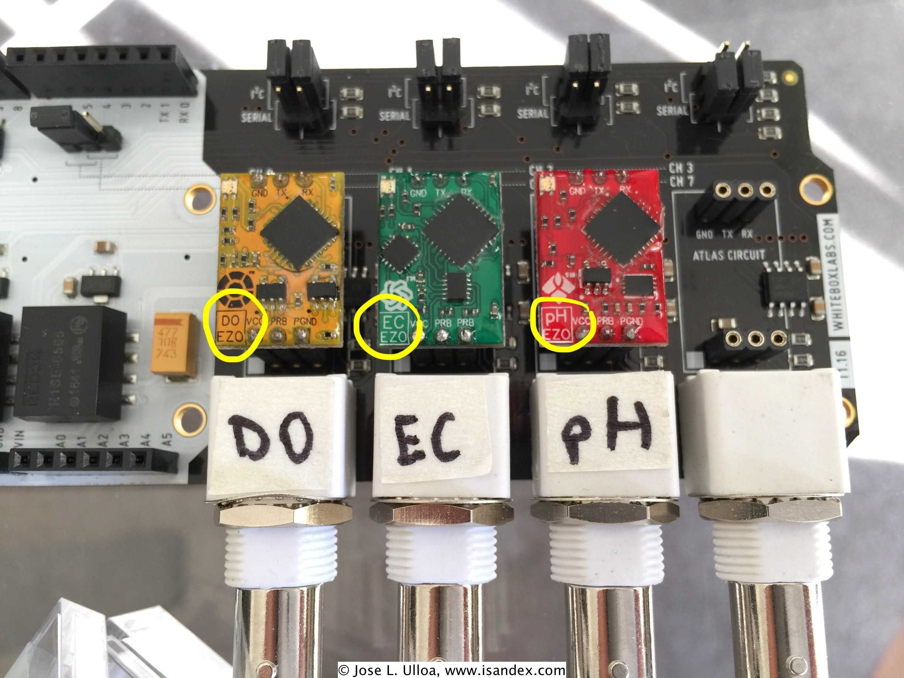

   Conexiones BNC para los sensores Atlas Scientific. Es importante mantener esa distribucion ya que cada circuito (Items #18, 19 y 20 en :ref:numref:`LdeMateriales`) es diferente (circulos amarillos) y el software esta configurado para la distribucion indicada

.. _atlas_sci_conn:
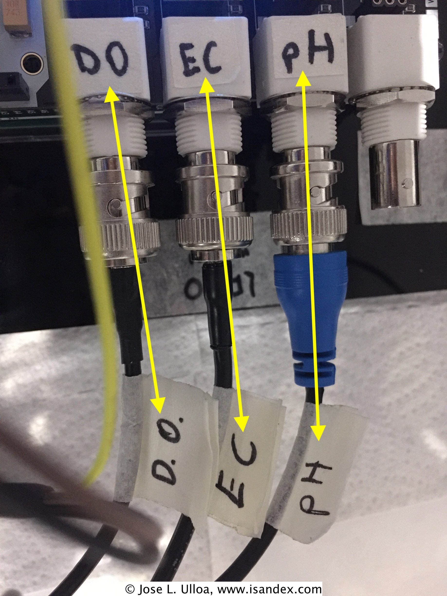

   Los conectores de cada sensor estan claramente identificados para coincidir con las entradas BNC

.. _final_checks:

Energizado del sistema, configuracion inicial del software y ubicacion definitiva
=================================================================================
1. Asegurarse que la |rpi|_ tiene la tarjeta de memoria en su lugar.

.. _check_sd:
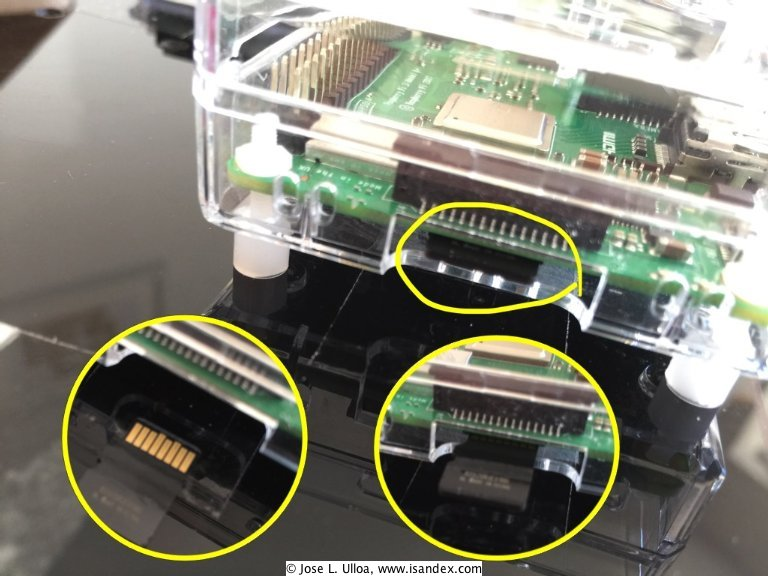

   La tarjeta micro SD (Item #4 en :ref:numref:`LdeMateriales`) deberia estar instalada en la |rpi|_. Si no es el caso, insertarla de acuerdo a la orientacion indicada

2. La fuente de poder (Item #3 en :ref:numref:`LdeMateriales`) se conecta a la |rpi|_ via el conector micro USB. ** IMPORTANTE ** asegurarse que la fuente de poder tiene el adaptador correcto para el tipo de enchufe.

.. _power_up:
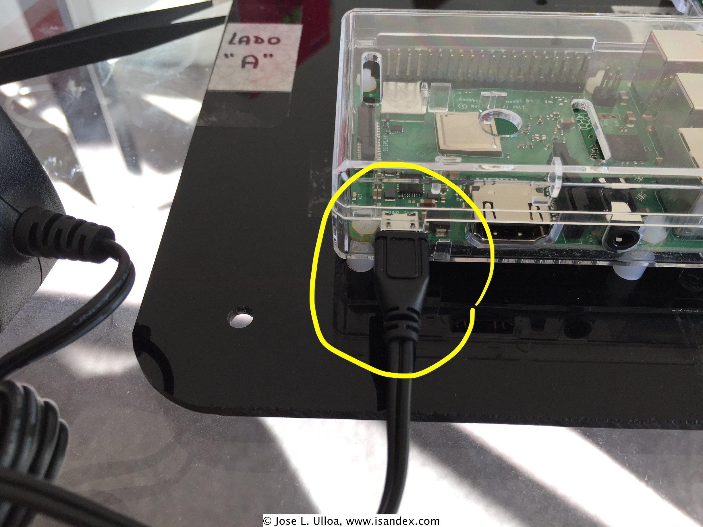

   La |rpi|_ se energiza mediante la conexion micro USB.

3. Verificar que la configuracion inicial de la |rpi|_ se hizo de acuerdo a lo indicado en :ref:`initial_conf`. En particular, asegurarse que se configuro el acceso a la red local y se habilito el inicio automatico del software |pydroponia|_

4. Una vez que el sistema esta listo para operar continuamente, ubicar los sensores en el medio hidroponico a medir. Si bien no es necesario, se recomienda que estos queden suspendidos en el medio acuoso, como se muestra en el diagrama la :ref:numref:`posicion_sensores`

.. _posicion_sensores:
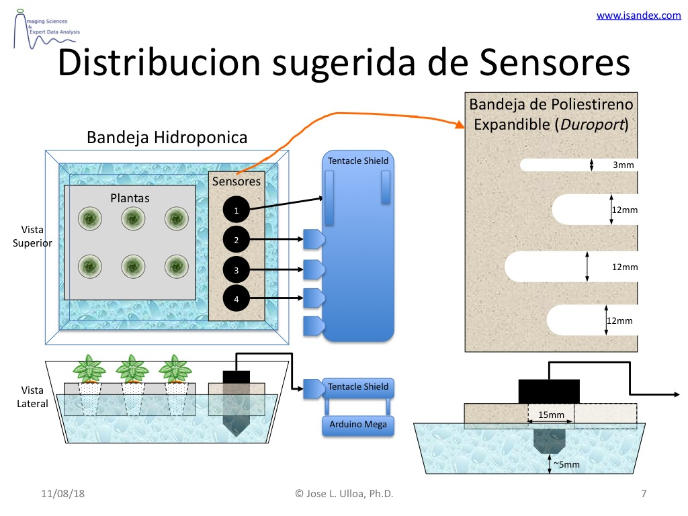

   Distribucion recomendada de los sensores en el medio hidroponico. 
