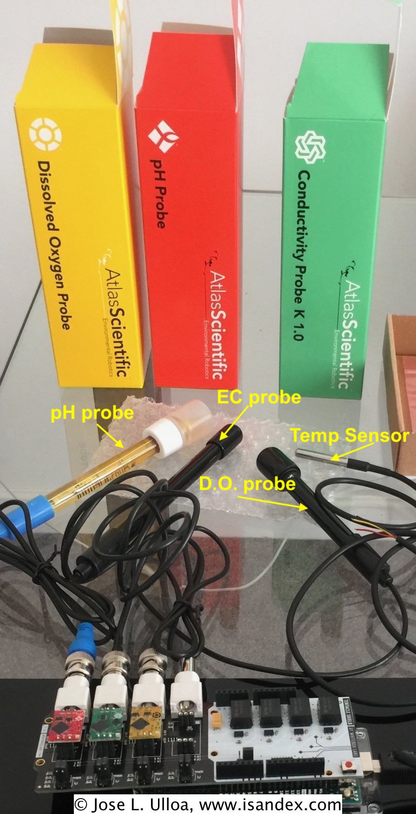

.. include:: global.rst

Calibracion de sensores - Arduino IDE
*************************************
Los 4 sensores van calibrados de acuerdo a las instrucciones del fabricante (link a los metodos de calibracion) 

De los 4 sensores que posee el sistema |pydroponia|_ solo el de pH require calibracion periodica una vez por año (link al metodo). Los otros 3 (temperatura, electroconductividad y oxygeno disuelto), no requieren re-calibracion ni mantencion periodica. Solamente, el sensor de oxygeno disuelto podria requerir cambiar la membrana al cabo de XXX tiempo (link)

.. _as_sensors:

   Sensores controlados por |pydroponia|

En caso de ser necesario, para calibrar los sensores se requiere 
*Work in progres...*
