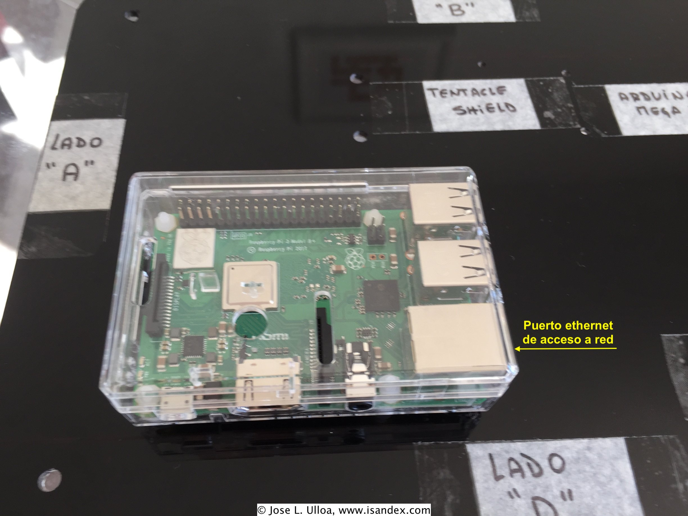

.. include:: global.rst

.. _initial_conf:

Configuracion inicial del Software Pydroponia
***********************************************
.. Una vez que el sistema se ha montado, segun las instrucciones en :ref:`armado`, la tarjeta micro SD esta en la posicion correcta y la fuente de poder conectada a la |rpi|_, procedemos a energizar el sistema.

.. ** IMPORTANTE ** asegurarse que la fuente de poder (Item #3 en :ref:numref:`LdeMateriales`) tiene el adaptador correcto para el tipo de enchufe.

.. ** Esta seccion es relevante solo si se necesita re-instalar o re-configurar el software. El sistema se entrega con el software ya configurado y listo para utilizar en la tarjeta micro SD (Item #4 en :ref:numref:`LdeMateriales`).**

El software |pydroponia|_ viene instalado y configurado en la tarjeta micro SD. Sin embargo, para habilitar el modo de inicio automatico, se debe primero configurar la |rpi|_ para la red local.

* La |rpi|_ que controla |pydroponia|_, esta pensada para operar en modo `headless <https://howtoraspberrypi.com/how-to-raspberry-pi-headless-setup/>`_ (i.e. sin monitor, teclado ni mouse). Sin embargo, es posible realizar la configuracion inicial de manera directa, conectando dispositivos perifericos a la |rpi|_. En las siguientes sub-secciones se detallan las instrucciones de configuracion para las distintas opciones de conexion. 
* El acceso a la red puede ser via cable o wifi. Este ultimo metodo proporciona mayor flexibilidad y movilidad al sistem, pero require saber los detalles de la conexion wifi. Consulte al administrador de la red para obtener esa informacion. 

Configuracion directa de conectividad wifi
=============================================
Es el metodo mas directo y sencillo, pero require conectar un monitor (HDMI), teclado y mouse (ambos USB) a la |rpi|_. Para mas detalles de como configurar dispositivos perifericos, revisar la `documentacion oficial <https://www.raspberrypi.org/documentation/setup/>`_ 

Una vez habilitado los dispositivos perifericos, encender la |rpi|_ (ver detalles en :ref:`final_checks`) y configurar la red wifi de acuerdo a las `instrucciones <https://www.raspberrypi.org/documentation/configuration/wireless/desktop.md>`_.

Una vez configurado el sistema a la red local, proceda a la seccion :ref:`cron`, para habilitar el inicio automatico de |pydroponia|_

Configuracion remota via SSH o VNC
=============================================
En este caso, se requiere conectar la |rpi|_ a un cable de red (ver :ref:numref:`ethaccess`).

.. _ethaccess:

   Puerto de acceso cable ethernet

Una vez conectado el cable de red, encender la |rpi|_ (ver detalles en :ref:`final_checks`) e identificar la direccion IP asignada por el router (consultar al administrador de red). 

1. Acceso via SSH
------------------
Desde cualquier otro computador con el protocolo SSH habilitado y acceso a la misma red, conectarse a la |rpi|_ via terminal:

.. code-block:: console 
	
   ssh pi@<direccion ip>
   
El password es el indicado en la caja de la |rpi|_

Siga las `instrucciones <https://www.raspberrypi.org/documentation/configuration/raspi-config.md>`_ para configurar el acceso a red mediante la applicacion ``raspi-config``

2. Acceso via VNC
------------------
Desde cualquier otro computador con alguna aplicacion de cliente VNC (por ejemplo `RealVNC <https://www.realvnc.com/en/connect/download/viewer/>`_) conectarse al servidor VNC de la |rpi|_ utilizando el formato ``<direccion ip>:1``. El password de acceso es el indicado en la caja de la |rpi|_

El acceso VNC permite iniciar una sesion grafica (i.e. Escritorio remoto), por lo que el acceso a red wifi se puede configurar de `manera simple <https://www.raspberrypi.org/documentation/configuration/wireless/desktop.md>`_.

Una vez configurado el acceso a red via wifi con cualquiera de los metodos descritos, proceda a la seccion :ref:`cron` para habilitar el inicio automatico de |pydroponia|_

.. _cron:

Habilitar inicio automatico del software |pydroponia|_
========================================================
Por defecto, el inicio automatico del software |pyrdoponia|_ esta deshabilitado, para permitir primero configurar el acceso a la red local. El inicio automatico de |pydroponia|_ se habilita mediante el comando ``crontab``:

1. En una terminal, escriba el comando:

.. code-block:: console

   crontab -e 

2. Descomente las dos ultimas lineas (i.e. borre el caracter `#` del comienzo de cada linea): 

.. code-block:: console

   #@reboot /home/pi/bin/bioagro/start.sh  >> /home/pi/.pydroponia/pydro.log 2>&1
   #@reboot sleep 120 && /home/pi/bin/bioagro/start_webserver.sh  >> /home/pi/.pydroponia/webpydro.log 2>&1

3. Cierre el archivo (``Ctrl + X`` y seleccione 'y' para guardar los cambios)
4. Apague la |rpi|_. Si no se esta usando la interfaz grafica, tipee el comando ``off.sh`` en la terminal.
5. Siga las instrucciones en la siguiente seccion (:ref:`armado`) para continuar con el montaje del sistem en el lugar definitivo.